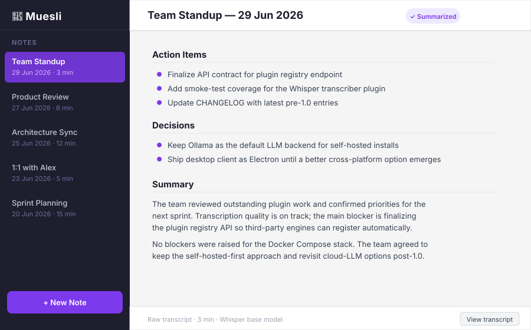

# Muesli 🥣

[](LICENSE)


A privacy-focused, self-hosted meeting-notes app: **self-hosted audio transcription and
self-hosted LLM summarization, with your data staying on infrastructure you control.**

Muesli is an open, self-hostable alternative to cloud meeting-notes apps. You
record a meeting, and Muesli transcribes it and rewrites your sparse notes into a
clean summary — but the transcription and summarization run as plugins _you_ host
(by default a self-hosted Whisper transcriber and a self-hosted Ollama LLM), so audio and
notes never have to leave infrastructure you control.

## Screenshots



> ⚠️ **Placeholder** — real screenshot pending. To replace: run `npm run dev`, open a note with a summarized body, take a screenshot (1280×800), save it as `docs/images/notes-ui.png`, then update the `notes-ui.svg` reference in this README to `notes-ui.png`.

## Requirements

Before running `docker compose up`, make sure your host meets these prerequisites:

- **Docker ≥ 24 and Compose v2** — the stack uses `docker compose` (plugin); the legacy `docker-compose` v1 standalone is not supported.
- **RAM** — ≥ 8 GB system RAM is recommended for comfortable CPU inference with the default `llama3.2:3b` model.
- **Disk space** — ~2 GB for the default LLM model; allow more if you plan to pull larger models. Whisper also fetches its model on the first transcription.
- **CPU vs GPU** — CPU inference works out of the box but is slow (the default dev setup); GPU acceleration is available — see the per-plugin Dockerfiles.

## Why Muesli

- **Private by default** — the reference plugins run on your self-hosted server; nothing is shipped
  to a third-party transcription or LLM SaaS.
- **Self-hostable** — one `docker compose up` on a NAS or a cloud box. Scale the
  pieces independently when you need to.
- **Pluggable** — transcription and summarization are language-agnostic HTTP
  plugins. Swap in any engine that speaks the contract; bring your own cloud LLM
  if you _choose_ to.
- **Current v3 feature set** — calendar integration with CalDAV / ICS / Google / Microsoft sync,
  note-linked events and Coming up; Chat / RAG over notes with citations; semantic search; speaker
  diarization with review and speaker aliases; export to Markdown, plain text, DOCX, PDF, and
  subtitle formats (SRT / ASS / WebVTT); tags, smart lists, folders, nesting, sibling reorder, and
  recycle bin / soft delete for notes and folders.
- **Open source** — AGPL-3.0; no lock-in, inspect everything.

## Quickstart

Bring up the entire stack (Postgres, Ollama, Whisper transcriber, LLM agent, and
the Muesli server) with one command:

```bash
docker compose up
```

Then open <http://localhost:8080/admin>, create your account, and you're done —
the default transcriber and agent plugins are **auto-registered on startup**, so
there are no manual admin steps.

First boot is slow: the `ollama-pull` service downloads the default LLM
(`llama3.2:3b`, ~2 GB) and Whisper fetches its model on the first
transcription. Expect a few minutes before the stack is fully ready. CPU
inference is slow — this is a local-first dev setup, not a tuned production
deployment. (For GPU acceleration, use the override described in the [GPU acceleration](#gpu-acceleration) section below.)

Deploying to production? See [docs/DEPLOYMENT.md](docs/DEPLOYMENT.md).

### One-line install

Use this for a production/hosted deployment. It fetches pinned copies of
`docker-compose.prod.yml` and `.env.example`, generates real secrets in `.env`,
and uses the GHCR-hosted images referenced by the production compose stack.

```bash
curl -fsSL https://raw.githubusercontent.com/abedegno/muesli/main/scripts/install.sh | sh
```

This is separate from the dev `docker compose up` quickstart above. The
installer writes the production files into `./muesli` by default; set
`MUESLI_INSTALL_REF` to fetch a different tag, branch, or commit, and use
`--up` if you want the script to start the stack after installation.

### GPU acceleration

An optional Compose override adds NVIDIA GPU support for Ollama and Whisper.
Requires the [NVIDIA Container Toolkit](https://docs.nvidia.com/datacenter/cloud-native/container-toolkit/install-guide.html) on the host.

```bash
docker compose -f docker-compose.yml -f docker-compose.gpu.yml up
```

The override sets `runtime: nvidia` + device reservations on the `ollama` service
and switches Whisper to `WHISPER_DEVICE=cuda` / `WHISPER_COMPUTE_TYPE=float16`.
All other services are unchanged.

No `.env` is required: every secret and URL has a built-in dev default. To
override anything, `cp .env.example .env` and edit.

**Troubleshooting:** See [docs/TROUBLESHOOTING.md](docs/TROUBLESHOOTING.md) for help with slow first boot, port conflicts, and other common issues.

## Desktop client

The Electron desktop client lives at the repo root:

```bash
npm install
npm run dev
```

Point it at your running server: <http://localhost:8080>.

## How it works

```
Desktop client ──upload──▶ Muesli server ──▶ Transcriber plugin ──▶ Agent plugin ──▶ note
   (capture)              (queue + pipeline)     (Whisper)             (Ollama)
```

The server stores your notes and audio, runs a worker pool that drives each
recording through transcribe → summarize, and serves an embedded admin UI at
`/admin`. Plugins are independent HTTP services. For the full picture — package
map, the plugin contract, and the processing pipeline — see
**[`docs/ARCHITECTURE.md`](docs/ARCHITECTURE.md)**.

## Documentation

| Doc                                                  | What's in it                                                                                                                                                           |
| ---------------------------------------------------- | ---------------------------------------------------------------------------------------------------------------------------------------------------------------------- |
| [`docs/index.md`](docs/index.md)                     | Master documentation index — all docs by use case.                                                                                                                     |
| [`docs/ARCHITECTURE.md`](docs/ARCHITECTURE.md)       | Contributor-oriented architecture: components, pipeline, package map, plugin contract, and the design rationale behind the privacy-first, self-hosted plugin approach. |
| [`docs/CONFIGURATION.md`](docs/CONFIGURATION.md)     | Complete reference for all `MUESLI_*` and plugin environment variables.                                                                                                |
| [`docs/DEPLOYMENT.md`](docs/DEPLOYMENT.md)           | Production runbook: install, TLS, sizing, backups, upgrades, and smoke checks.                                                                                         |
| [`docs/API.md`](docs/API.md)                         | HTTP API reference: JSON models, endpoints, auth rules, and response shapes.                                                                                          |
| [`docs/PLUGINS.md`](docs/PLUGINS.md)                 | Plugin authoring guide: the transcriber/agent contract, required endpoints, auth, and validation flow.                                                                 |
| [`docs/BACKUP.md`](docs/BACKUP.md)                   | Backup and restore guide for the Postgres database and audio blob store.                                                                                               |
| [`docs/UPGRADING.md`](docs/UPGRADING.md)             | Upgrade procedure for pulling or rebuilding images, restarting, and handling migrations.                                                                               |
| [`docs/TROUBLESHOOTING.md`](docs/TROUBLESHOOTING.md) | Common issues: slow first boot, port conflicts, reading logs, and telling "still loading" from broken.                                                                 |
| [`CONTRIBUTING.md`](CONTRIBUTING.md)                 | Dev setup, conventions, and how to land a change.                                                                                                                      |
| [`SECURITY.md`](SECURITY.md)                         | How to report a vulnerability (privately) + operator responsibilities.                                                                                                 |
| [`CODE_OF_CONDUCT.md`](CODE_OF_CONDUCT.md)           | Community standards.                                                                                                                                                   |
| [`CHANGELOG.md`](CHANGELOG.md)                       | What's changed.                                                                                                                                                        |
| [`ROADMAP.md`](ROADMAP.md)                           | High-level milestones (v2 → v5) closing the gap to Granola and into enterprise.                                                                                        |

## Security note

The compose file ships **DEV-ONLY** default secrets (master key, storage signing
key, plugin tokens, Postgres password) so `docker compose up` just works. **Do
not run these defaults in production.** Before any real deployment, copy
`.env.example` to `.env` and set real values — in particular generate a fresh
`MUESLI_MASTER_KEY` and `MUESLI_STORAGE_SIGNING_KEY` with `openssl rand -base64 32`,
and terminate TLS at a reverse proxy. See [`SECURITY.md`](SECURITY.md).

## Status

Muesli is **pre-1.0** and under active development. The current v3 feature set
covers calendar integration, Chat/RAG over notes, speaker diarization with
review and speaker aliases, semantic search, multi-format export, and tags,
smart lists, folders, and recycle bin support. The product is still evolving,
and there is more polish and broader multi-user work ahead on the
[roadmap](ROADMAP.md).

## Contributing

Contributions are welcome — see [`CONTRIBUTING.md`](CONTRIBUTING.md) to get
started, and please open an issue before tackling anything non-trivial.

## License

[GNU Affero General Public License v3.0](LICENSE). If you run a modified Muesli
as a network service, the AGPL requires you to make your changes available to its
users.
